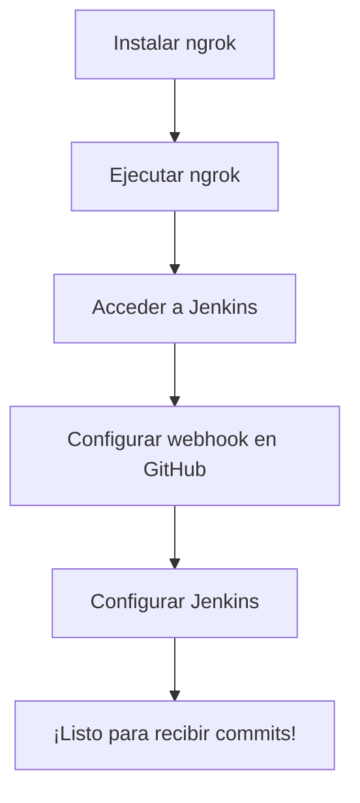

# NodeJs, helloworld API for test propouses.

This is a simple API that returns a welcome message.

## Run your local environment

### Clone the repository
```bash
git clone https://github.com/edgaregonzalez/nodejs-helloworld-api.git
```

### Install dependencies
```bash
npm install
```

### Run the tests
```bash
npm test
```

### Start the server
```bash
npm start
```

### Make a request
```bash
curl http://localhost:3000
```

# CI/CD

# Tutorial para configurar Jenkins con ngrok

1. **Instalar ngrok:**
   - Descarga ngrok desde [su sitio web](https://ngrok.com/download).
   - Sigue las instrucciones de instalación para tu sistema operativo.

2. **Ejecutar ngrok para exponer Jenkins:**
   - Abre una terminal y ejecuta el siguiente comando para exponer Jenkins localmente a través de ngrok:
     ```sh
     ngrok http http://localhost:8080
     ```
   - Esto abrirá un túnel y te proporcionará un enlace público que puedes utilizar para acceder a Jenkins.

3. **Acceder a Jenkins a través de ngrok:**
   - Abre tu navegador web y dirígete al enlace proporcionado por ngrok. Por ejemplo:
     ```
     https://08e9-152-170-177-208.ngrok-free.app/
     ```
   - Inicia sesión en Jenkins con tus credenciales.


4. **Configurar el webhook en GitHub:**
   - En tu repositorio en GitHub, ve a la sección de Configuración (Settings) y luego a Webhooks.
   - Agrega una nueva URL de webhook apuntando al siguiente enlace de ngrok seguido de `/github-webhook/`. Por ejemplo:
     ```
     https://08e9-152-170-177-208.ngrok-free.app/github-webhook/
     ```
   - Selecciona los eventos que deseas que desencadenen el webhook, como "push" y "pull request".


5. **Configurar Jenkins para recibir notificaciones de GitHub:**
   - En Jenkins, configura un nuevo pipeline o proyecto.
   - Agrega las credenciales de GitHub y la URL del repositorio que deseas utilizar.
     


6. **¡Listo para recibir commits!**
   - A partir de ahora, cada vez que hagas un commit en tu repositorio, Jenkins responderá automáticamente si es un push o pull request a la rama principal.


# Diagrama alto nivel CI/CD



